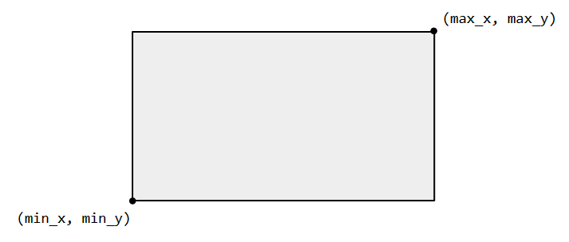

# R&D recruitment exercise

The purpose of this exercise is to evaluate your Angular skills, basic knowledge of Python and your thought process.
Some parts of the instructions may be subject to interpretation.
If that is the case, we encourage you to make the necessary assumptions to go forward.

The exercise is separated in 2 parts:

* Angular front-end implementation
* Python back-end endpoint creation

## Repository structure

There are 3 folders at the root of this repository:

* `backend`: where the backend is implemented
* `frontend`: where you will implement your Angular application
* `images`: where the README images are stored

## Front-end

The goal is to create an Angular application, consisting of a single page, which serves as a medium for users to visualize the data of their stores for a specific period.
All the information necessary for this exercise should be acquired using the provided back-end.

The users have a specific way of designating a date: instead of using the actual date, they use the week number and the year.
For instance, instead of 2023-07-17, they will write W29 2023. Each client has its own custom week numbering.

The application should therefore manipulate the week & year primarily, with an indicator of the corresponding date.

In order to visualize data, the users must select:
* a store
* a period

When the user has submitted a store and a valid period, the application should display graphs representing the data returned by the back-end.
The graphs will update upon changing the selection.

The back-end only has data for a limited range, and the Angular application should inform the user if the given range is out of bounds.

All the UI is left to your discretion, the only requirement being that it should be clear and intuitive to use.
The exercise is kept simple as the goal is not for you to spend too much time on it.
The emphasis is on code quality, good practices and efficiency.

### Instructions

* implement the Angular application from scratch
* the app must provide a way for the user to select a store and a period for which to visualize data
* the user must not be able to submit a selection if it is not valid (if the selection is invalid, the UI should provide the user with a clear explanation of what is wrong)
* use the provided API to validate the period selected by the user
* represent the data returned by the API in a visual way that you find relevant

### Bonus

If you still have some time to spend on the exercise, you can add a second page in the Angular application.
This page will display a map of the store with some zones on it.

You will find the data required for this in the Bonus section of the API.
There are 3 different endpoints:

* `get_map` returns a PNG file representing the store
* `get_bounding_box` returns a bounding box corresponding to the store (more information below)
* `get_zones` returns a list of zones with their names, colors and coordinates

The goal of this bonus exercise is to:

* display the store map and represent the zones on top of it
* each zone should have its own color and be partially transparent so we can see the map beneath it

#### Bounding box

The bounding box is represented using 4 values:

* `min_x`
* `max_x`
* `min_y`
* `max_y`

It allows you to convert the zones coordinates into pixels for plotting zones onto the PNG image.

## Back-end

A basic back-end is already implemented in the corresponding folder.
It has been tested with Python 3.8.
To launch it:

1. Create a virtual environment (ideally Python 3.8, but higher versions should also work)
2. Install the required dependencies: `pip install -r requirements.txt`
3. Launch it either via your IDE or by executing `main.py`: `python app/main.py`

The back-end will then be running on `localhost:8000`.

For a list of available endpoints, navigate to `localhost:8000/docs`.

### Instructions

* Implement a new endpoint to detect whether a given period includes a Friday the 13th
* Using OpenAPI, regenerate an Angular client of the back-end
* Incorporate the new endpoint into your Angular application so that the user cannot submit a period containing a Friday the 13th

### OpenAPI Generator

One way to generate an Angular client of the back-end is to use [OpenAPI Generator](https://github.com/OpenAPITools/openapi-generator).
Based on the OpenAPI JSON spec (http://localhost:8000/openapi.json), this tool will automatically generate a client in the language/framework of your choice.

Depending on your platform, you can either download a JAR, install the generator using Homebrew, or execute a Docker image.
